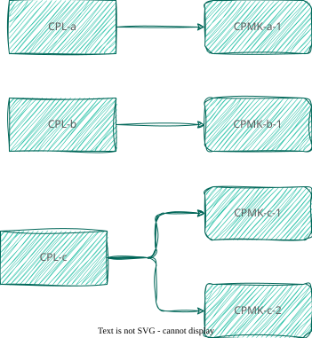

# CPL-CPMK

## Pengenalan

Terdapat 2 jenis capaian pembelajaran dalam setiap perkuliahan: (1) Capaian Pembelajaran Lulusan (CPL) dan (2) Capaian Pembelajaran Mata Kuliah (CPMK). CPL adalah butir-butir capaian yang ditetapkan oleh PS PWK ITERA dan menjadi indikator pemenuhan pembelajaran seorang lulusan PS PWK ITERA. CPMK adalah turunan dari butir-butir CPL yang berlaku untuk kelulusan mata kuliah tersebut.

Satu mata kuliah biasanya hanya memiliki beberapa CPL yang masing-masing butirnya memiliki turunan yang lebih kontekstual kepada CPMK.

 Hubungan CPL-CPMK

Dalam PS PWK ITERA terdapat kodifikasi yang mengindikasikan hubungan tersebut. Ini dijelaskan sebagai berikut:

- **`CPL-a`**: `a` adalah kode CPL berupa angka 2 digit ('1' → '01') yang menyatakan butir CPL
- **`CPMK-a-1`**: adalah kode CPMK yang sebelumnya diberi kode CPL dengan format 1 digit.

Dalam kasus khusus, yakni CPMK yang menginduk kepada 2 CPL, kodifikasinya menyesuaikan: `a` akan menjadi `ab` dengan masing-masingnya adalah kode angka dengan format 1 digit. Selanjutnya butir CPMK tersebut dibedakan dengan kode CPMK-nya. Dengan demikian, `CPMK-710-1` dan `CPMK-107-1` pada hakikatnya adalah CPMK yang sama, karena ia adalah satu CPMK yang menginduk pada `CPL-07` dan `CPL-10`.

## Penulisan Kalimat CPL/CPMK

Baik kalimat CPL maupun CPMK, atau turunannya menjadi Sub-CPMK, memiliki anatomi yang sama: kata kerja operasional (KKO), bahan kajian *(subject matter)*, dan konteks/keterangan.

- KKO adalah kata kerja yang bersifat aksi *(action verb)*. Inilah yang menjadikan capaian pembelajaran dapat diukur pemenuhannya. Jadi, alih-alih "memahami", kita gunakan "menjelaskan" sebagai *action verb*-nya.
- Bahan kajian adalah objek yang dikenakan oleh KKO-nya. Ini yang disesuaikan dengan mata kuliahnya masing-masing. MIsalnya, dalam statistika bahan kajiannya adalah "analisis deskriptif", sementara dalam transportasi "bangkitan dan tarikan pergerakan"
- Keterangan atau konteks adalah penjelas dari KKO + Bahan Kajian tadi yang memberikan identitas atau kekhasan dari CPL/CPMK. Misalnya, "... dalam konteks Sumatera", atau "... sebagai pendekatan cerdas dalam perencanaan"

Kombinasi KKO dan Bahan kajian ini disesuaikan dengan **Taksonomi Bloom Revisi**. Setiap mata kuliah hendaknya memiliki tingkatan kemampuan kognitif paling rendah di C4 (menganalisis) dan paling tinggi C6 (mengkreasikan).

> [!info] Patokan lain selai KKO
> Tingkatan taksonomi Bloom juga bisa dibedakan dari dimensi pengetahuan yang tercermin dalam bahan kajiannya. Dimensi pengetahuan ini dimulai dari pengetahuan **faktual**, **konseptual*, **prosedural**, dan yang paling tinggi **metakognitif**. Saya tuliskan saja keterangan masing-masingnya dalam bahasa Inggris:
> 
> - **Factual:** The basic building blocks of a subject. It involves "knowing what" and includes isolated details, terminology, and specific facts (e.g., memorizing the boiling point of water). 
> - **Conceptual:** The organization of facts into a larger structure. It involves recognizing relationships, classifications, principles, and theories (e.g., understanding the molecular structure of water).   → saya kira ini sudah mulai masuk C4
> - **Procedural:** The "how-to" knowledge. It involves carrying out processes, methods, algorithms, and knowing exactly _when_ to apply specific skills (e.g., performing a titration experiment in a lab). 
> - **Metacognitive:** Self-awareness of your own cognition. It involves strategic thinking, understanding how you learn, and adapting your cognitive processes to complete a task effectively (e.g., realizing you need to draw a diagram to understand a complex physical system)
