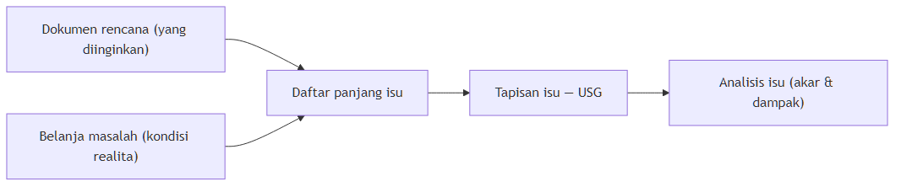

# Bab 4: Perumusan Isu Awal {#sec-bab4}

Bab ini menyiapkan landasan untuk mengidentifikasi persoalan wilayah studi dengan cara yang benar sejak awal. Sasaran akhirnya sederhana: memastikan yang kita kira masalah memang masalahnya.

Cara yang berguna untuk memahami isu perencanaan adalah melihatnya sebagai sebuah celah (*gap*): jarak antara kondisi yang diinginkan dan kondisi nyata di wilayah studi. Isu perencanaan adalah masalah yang menempati celah itu. Karena celah punya dua sisi, merumuskan isu sejak awal berarti mengerjakan dua sisi sekaligus. Sisi pertama adalah arah pembangunan yang diinginkan; salah satu cara menelusurinya adalah membaca dokumen-dokumen rencana yang mengikat wilayah studi (subbab 4.1). Sisi kedua adalah kondisi nyata di lapangan; cara menelusurinya adalah belanja masalah (subbab 4.2). Setelah kedua sisi bertemu, kita menyusun daftar panjang isu (subbab 4.3) dan menyerahkannya ke tahap berikutnya untuk ditapis (subbab 4.4).

Sepanjang 16 pekan, Studio Dasar Perencanaan menuntun Anda pada satu alur yang menyempit: bermula dari serakan temuan di wilayah studi, lalu mengerucut menjadi satu kalimat isu perencanaan yang menjawab "apa yang seharusnya ditangani dalam penyusunan rencana nantinya?". Bab ini mengerjakan bagian pra-survei dari alur tersebut — menyusun hipotesis isu dari data sekunder dan pengamatan awal, yang baru dikonfirmasi kebenarannya lewat data primer setelah kelompok Anda turun ke lapangan.

Alur bab ini dan bab sesudahnya dapat dilihat pada diagram berikut:

::: {.callout-note title="Error tipe-III: menjawab dengan benar masalah yang salah"}

Dalam statistika, *error* tipe-I adalah kesalahan menolak hipotesis nol yang sesungguhnya benar, sedangkan *error* tipe-II adalah kesalahan menerima hipotesis nol yang sesungguhnya salah. Keduanya adalah kesalahan pada tahap analisis: pertanyaannya sudah benar, tetapi proses menjawabnya keliru.

Dunn (2017) meminjam istilah *error of the third type* untuk kesalahan yang jauh lebih mahal — kesalahan pada tahap perumusan masalah. Kimball menyebutnya "memberikan jawaban yang benar untuk masalah yang salah"; Raiffa menyebutnya "memecahkan masalah yang salah" (*solving the wrong problem*). Seorang analis boleh mengolah data dengan sempurna, tetapi bila masalah yang dirumuskannya bukan masalah sesungguhnya, seluruh analisis sesudahnya sia-sia.

Bab ini sepenuhnya dibangun untuk mengecilkan peluang terjadinya *error* tipe-III: kita memperlambat langkah agar yang kita sebut "masalah" betul-betul masalahnya.

:::

## 4.1 Menelaah Dokumen-dokumen Rencana {#sec-41}

Sisi pertama dari celah isu adalah "apa yang diinginkan": arah pembangunan dan penataan ruang yang seharusnya berlaku di wilayah studi. Arah itu jarang ditentukan sendiri oleh kelompok studio — ia sudah dituangkan dalam dokumen-dokumen rencana yang mengikat wilayah di atasnya. Menelaah dokumen-dokumen ini sejak awal membuat belanja masalah (subbab 4.2) lebih terarah: alih-alih mengumpulkan segala dugaan masalah yang terlintas, Anda tahu lebih dulu hal apa saja yang sesungguhnya diamanatkan untuk wilayah studi Anda.

Dokumen rencana yang ditelaah terbagi ke dalam dua kategori saja: **tata ruang** dan **pembangunan**. Kategori tata ruang meliputi Rencana Tata Ruang Wilayah (RTRW) dan Rencana Detail Tata Ruang (RDTR); kategori pembangunan meliputi Rencana Pembangunan Jangka Panjang (RPJP) dan Rencana Pembangunan Jangka Menengah (RPJM). Kedua kategori itu dibedakan pula menurut horizon waktu dan cakupan wilayah:

| Kategori | Dokumen | Horizon waktu | Cakupan wilayah |
|---|---|---|---|
| Tata ruang | RTRW (Rencana Tata Ruang Wilayah) | Panjang (20 tahun) | Nasional, provinsi, kabupaten/kota |
| Tata ruang | RDTR (Rencana Detail Tata Ruang) | Panjang (20 tahun) | Bagian dari kabupaten/kota |
| Pembangunan | RPJP (Rencana Pembangunan Jangka Panjang) | Panjang (20 tahun) | Nasional, provinsi, kabupaten/kota |
| Pembangunan | RPJM (Rencana Pembangunan Jangka Menengah) | Menengah (5 tahun) | Nasional, provinsi, kabupaten/kota |

RTRW secara otomatis berjangka 20 tahun, demikian pula RDTR sebagai rinciannya. RPJP berjangka 20 tahun, sedangkan RPJM berjangka 5 tahun.

Penelaahan bergerak dari cakupan paling besar ke paling kecil, dan dari horizon panjang ke pendek. Misalkan wilayah perencanaan Anda adalah Kecamatan X di Kabupaten S, Provinsi M. Urutan penelaahannya: baca dulu apa yang diamanatkan untuk Provinsi M dalam RTRW Nasional, lalu turun ke RPJM Nasional; kemudian masuk lebih dalam — bagaimana Kabupaten S ditempatkan dalam RTRW, RPJP, dan RPJM Provinsi M; terakhir turun ke RTRW Kabupaten S untuk melihat bagaimana Kecamatan X diarahkan. Dengan urutan ini, setiap dugaan masalah yang Anda kumpulkan kelak dapat diuji: apakah ia bertentangan dengan arahan di atasnya, atau justru merupakan hambatan yang menjauhkan wilayah dari arah itu.

Hasil penelaahan dituangkan ke dalam tabel data terstruktur, sama seperti hasil belanja masalah nanti. Yang wajib dicatat pada setiap baris adalah periode rencana, nomor produk peraturan perundang-undangannya, serta bab, pasal, dan ayat dari keterangan yang dirujuk — agar amanat itu dapat ditelusuri kembali oleh siapa pun. Tabel berikut memperagakan beberapa baris (angka dan nomor sepenuhnya ilustratif):

| Tingkat | Dokumen | Periode | Nomor produk hukum | Bab/Pasal/Ayat | Amanat yang relevan bagi Kecamatan X |
|---|---|---|---|---|---|
| Nasional | RTRW Nasional | 20xx–20xx | Perpres Nomor … Tahun … | Bab …, Pasal … | Provinsi M termasuk kawasan andalan sektor pertanian. |
| Nasional | RPJM Nasional | 20xx–20xx | Perpres Nomor … Tahun … | Bab …, Pasal … | Sasaran peningkatan konektivitas antarwilayah pada koridor M. |
| Provinsi | RTRW Provinsi M | 20xx–20xx | Peraturan Daerah Nomor … Tahun … | Bab …, Pasal … | Kabupaten S diarahkan sebagai pusat kegiatan lokal. |
| Kabupaten | RTRW Kabupaten S | 20xx–20xx | Peraturan Daerah Nomor … Tahun … | Bab …, Pasal … | Kecamatan X ditetapkan sebagai kawasan budi daya pertanian lahan basah. |

## 4.2 Belanja Masalah {#sec-42}

Sisi kedua dari celah isu adalah "kondisi realita": apa yang sesungguhnya terjadi di wilayah studi. Menelusuri sisi ini kita sebut belanja masalah. Tujuannya bukan langsung menyimpulkan satu persoalan, melainkan merekam sebanyak mungkin dugaan masalah dari berbagai sumber, supaya tidak ada persoalan penting yang terlewat hanya karena tidak kita lihat sejak awal. Berbekal arahan dari dokumen-dokumen rencana (subbab 4.1), belanja masalah menjadi lebih terarah — Anda tahu persis apa yang harus dicari.

### 4.2.1 Kondisi, Masalah, dan Isu {#sec-421}

Sebelum mengumpulkan apa pun, kita perlu membedakan tiga hal yang sering dicampur. Dunn membedakan *problem situation*, *policy problem*, dan *policy issue* (Dunn, 2017).

| Konsep | Makna | Bentuk di studio |
| --- | --- | --- |
| Kondisi (*problem situation*) | Kekhawatiran yang tersebar, tanda-tanda stres yang masih samar, atau kejutan yang belum punya solusi. | Serakan temuan di wilayah studi yang belum Anda putuskan artinya — foto, keluhan, dan angka mentah yang belum menjadi satu masalah. |
| Masalah (*policy problem*) | Representasi dari kondisi tersebut; lahir dari pikiran dan lingkungan, bukan objek yang "ada di luar sana". | Satu temuan yang sudah Anda pilih dan bingkai sebagai kalimat kondisi — keputusan "inilah masalahnya", bukan sekadar salinan catatan. |
| Isu (*policy issue*) | Formulasi masalah yang berbeda-beda menurut pandangan dan kepentingan aktor. | Masalah yang sama dirumuskan berbeda oleh pihak yang berbeda; kalimat isu yang netral dan konstruktif, siap ditapis. |

Misalnya, rekan satu kelompok Anda mengumpulkan bermacam-macam informasi dari internet yang jenisnya beragam: ada foto talud jalan yang longsor, keluhan warga bahwa permukiman mereka banjir tiap hujan besar, dan cerita petani sayur yang kesulitan menjual hasil panen. Bahan-bahan itu belum menunjuk masalah apa pun — masih berupa *problem situation*, kondisi yang belum diputuskan artinya. Menjadi masalah justru ketika Anda memilih apa yang disorot dari bahan itu: kelompok Anda merumuskan "tergenangnya rumah warga", sedangkan kelompok lain, dari bahan yang sama, merumuskan "terhambatnya penjualan hasil panen petani". Dua kalimat itu adalah dua *policy problem* yang berbeda — dibingkai dari satu kondisi yang sama, bukan objek "di luar sana" yang tinggal disalin. Berpindah ke *policy issue* terjadi satu tingkat di atasnya: masalahnya sudah sama, tetapi rumusannya diperdebatkan. Untuk "tergenangnya rumah warga" yang sama, satu pihak menilai drainase yang harus dibenahi, pihak lain menilai permukiman yang harus dipindah. Perbedaan rumusan itulah isu — isu lahir karena para aktor merumuskan masalah yang sama secara berbeda menurut pandangan dan kepentingannya.

| Lapisan | Pertanyaan yang dijawab | Contoh |
|---|---|---|
| Kondisi (*problem situation*) | Apa yang kita temukan? | "Talud jebol", "rumah tergenang", "panen sulit dijual" — semuanya ada, tetapi tidak satu pun berstatus masalah. |
| Masalah (*policy problem*) | Bagaimana kita menafsirkan temuan itu? | Kelompok A: "tergenangnya rumah warga". Kelompok B: "terhambatnya penjualan hasil panen petani". |
| Isu (*policy issue*) | Di mana perdebatan penanganannya? | Untuk "tergenangnya rumah warga": satu pihak menilai drainase yang harus dibenahi, pihak lain menilai permukiman yang harus dipindah. |

Poin penting dari Dunn adalah bahwa analis lebih sering gagal karena memecahkan masalah yang salah dibanding karena solusinya salah. Kesalahan semacam ini kita kenal sebagai *error of the third type* — "memformulasikan masalah yang salah" — yang sudah dibahas pada kotak di awal bab. Karena itu, bab ini menaruh perhatian bukan pada kecepatan sampai ke jawaban, melainkan pada ketepatan sampai ke rumusan masalah.

### 4.2.2 Sumber Belanja Masalah {#sec-422}

Dalam kerangka Dunn, belanja masalah adalah wujud operasional dari dua langkah awal *problem structuring*: *problem sensing* dan *problem search*. *Problem sensing* bukan sekadar menyadari bahwa wilayah studi "punya masalah"; intinya adalah merasakan jarak antara kondisi yang teramati dan kondisi yang seharusnya atau yang Anda harapkan — Dunn menyebut keadaan ini *unsettled belief*, keyakinan yang belum tuntas ketika menghadapi situasi yang masih samar tetapi menuntut tindakan. Karena tolok ukur "seharusnya" itu berbeda-beda antar orang, kondisi yang sama bisa terasa sebagai masalah bagi satu pihak dan bukan bagi pihak lain — pendatang baru kerap langsung menangkap hal yang "tidak baik-baik saja" yang sudah dianggap wajar oleh penduduk lama, sementara penduduk lama justru merasakan tekanan yang luput dari pandangan pendatang. Inilah akar dari poin konstruksi yang dibahas di 4.2.1. Dari rasa itulah *problem search* mulai bekerja: memburu representasi masalah dari sebanyak mungkin pihak dan sumber.

Belanja masalah pada tahap ini masih dikerjakan dari meja: menyusun dugaan isu dari data sekunder, jauh sebelum berangkat ke lapangan untuk verifikasi. Ada tiga jenis sumber yang lazim dirujuk:

1. **Media populer** — berita, laporan, atau situs web non-berita yang membahas kondisi wilayah studi. Berguna untuk menangkap persoalan yang sedang ramai dibicarakan publik.
2. **Artikel ilmiah** — jurnal, prosiding, atau laporan penelitian. Berguna untuk menangkap persoalan yang sudah diuji atau dianalisis secara lebih sistematis.
3. **Media sosial** — unggahan dan perbincangan warga. Berguna untuk menangkap persoalan yang dirasakan langsung di lapangan, termasuk yang belum muncul di media atau literatur.

Menggunakan ketiga jenis sumber ini sekaligus bukan sekadar mengumpulkan banyak data. Ini adalah bentuk triangulasi: persoalan yang muncul dari lebih dari satu jenis sumber lebih dapat dipercaya sebagai masalah yang nyata, bukan sekadar kesan salah satu pihak.

::: {.callout-note title="Catatan"}

Ingat bahwa isu adalah hal yang belum tervalidasi. Apa yang Anda rekam pada tahap ini statusnya masih dugaan — hipotesis isu yang akan diuji. Mencampurkan fakta, opini, dan dugaan dalam satu tabel tanpa keterangan akan membuat tahap berikutnya sulit, karena itu setiap baris perlu ditandai statusnya sebagaimana dijelaskan berikut ini.

:::

#### Status informasi: fakta, opini, atau dugaan? {.unnumbered}

Status sebuah baris menentukan apa yang boleh dan tidak boleh kita lakukan terhadapnya, karena itu ketiganya perlu dipisahkan dengan jelas:

| Jenis | Ciri | Contoh | Status verifikasi |
|---|---|---|---|
| Fakta | Pernyataan yang dapat diperiksa benar-salahnya lewat data atau sumber yang tertelusur. | "Tutupan hutan di lereng atas turun dari 40% menjadi 22% dalam sepuluh tahun." | Terverifikasi; dipakai sebagai pijakan rumusan isu. |
| Opini | Penilaian atau pendapat pihak tertentu; tidak menggambarkan keadaan itu sendiri, melainkan cara pandang terhadapnya. | "Pemerintah daerah tidak serius menangani banjir." | Tidak perlu dibuktikan benar; berguna sebagai tanda arah pertentangan pandangan antar-aktor. |
| Dugaan | Pernyataan yang masih berupa perkiraan hubungan sebab-akibat atau keadaan, belum diuji. | "Sebagian sumur warga di lereng atas keruh saat musim hujan." | Belum terverifikasi; masuk daftar yang harus diuji lewat data primer di lapangan. |

Memisahkan ketiganya sejak menulis tabel memberi tiga kemudahan yang berpijak langsung pada konsep 4.2.1. Pertama, isu yang akan dirumuskan (subbab 4.3) harus ditulis sebagai kondisi yang terukur — bahan bakunya adalah fakta: masalah memang dibangun dari kondisi, bukan dari penilaian sepihak. Kedua, opini justru berharga sebagai penanda bahwa sebuah masalah dipandang berbeda oleh para pihak; dari perbedaan itulah isu (*policy issue*) lahir. Ketiga, dugaan adalah baris-baris yang paling menentukan jadwal kerja kelompok: baris-baris inilah yang harus dibawa ke lapangan untuk diverifikasi dengan data primer, karena data sekunder tidak cukup untuk memastikannya.

Manfaat pemisahan ini juga terasa pada tapisan isu di bab berikutnya. Rubrik penilaian tapisan menuntut setiap skor disertai bukti yang dapat ditelusuri — baris yang mencampur fakta, opini, dan dugaan akan membuat skor tidak dapat dipertanggungjawabkan. Kalau sejak tabel belanja masalah statusnya sudah jelas, menuliskan bukti pada tahap tapisan menjadi pekerjaan memindah, bukan pekerjaan menebak.

### 4.2.3 Pemilahan Menurut Aspek Kajian {#sec-423}

Belanja masalah tidak dikerjakan oleh seluruh anggota dengan cara yang sama. Sejak awal studio, setiap kelompok dibagi ke dalam lima aspek kajian. Pembagian ini sejalan dengan cara Anda menyusun profil wilayah pada bagian sebelumnya. Setiap anggota menelusuri sumber pada aspeknya masing-masing, sehingga sejak baris pertama ditulis, temuan sudah mengelompok menurut aspeknya — kita tidak perlu lagi memilah-milah belakangan.

Lima aspek tersebut, beserta fokus yang ditelusuri oleh masing-masing aspek, adalah sebagai berikut:

| Aspek kajian | Fokus yang ditelusuri |
|---|---|
| Fisik dan Lingkungan | Kondisi fisik alami dan batas ambang pengembangan kawasan: zona rawan bencana (banjir, longsor, erosi, kebakaran permukiman), topografi dan kemiringan lereng, daya dukung lingkungan, serta pola tutupan lahan untuk mengenali area resapan air dan area layak bangun. |
| Sosial Kependudukan dan Budaya | Struktur demografi dan dinamika spasial penduduk: pertumbuhan, kepadatan, proyeksi penduduk, rasio ketergantungan, serta nilai kearifan lokal dan tradisi keruangan. |
| Sosial Ekonomi | Basis perekonomian dan struktur penghidupan masyarakat: mata pencaharian, tingkat pendapatan dan kesejahteraan, serta sebaran nodus kegiatan ekonomi (pasar, koridor perdagangan-jasa, sentra UMKM). |
| Infrastruktur (Sarana dan Prasarana) | Ketersediaan, kondisi, dan jangkauan pelayanan sarana-prasarana: radius pelayanan sarana umum, cakupan utilitas dasar (air bersih, sanitasi, persampahan, drainase, energi), serta jaringan jalan dan sistem transportasi. |
| Kelembagaan dan Pembiayaan | Tata kelola dan pendanaan pembangunan: peran dan wewenang instansi serta kelompok swadaya masyarakat, alur perencanaan partisipatif (Musrenbang), dan alokasi dana pembangunan (APBD, Dana Desa, dan lain-lain). |

Pembagian ini sekaligus menyiapkan baris-baris belanja masalah agar kelak sejajar dengan tapisan isu pada bab berikutnya, yang juga mengelompokkan isu menurut lima aspek yang sama.

### 4.2.4 Mengorganisasi Daftar Masalah dalam Tabel Data Terstruktur {#sec-424}

Hasil belanja masalah dituangkan ke dalam satu tabel, dengan satu baris mewakili satu kondisi atau keadaan yang ditemukan beserta masalah yang dibingkai darinya. Kolom yang dipakai adalah sebagai berikut:

| Kolom | Isi |
|---|---|
| Kode entri | Nomor urut unik untuk setiap baris, agar mudah dirujuk kembali. |
| Aspek | Aspek kajian yang sedang dianalisis (lihat 4.2.3). |
| Kondisi *(problem situation)* | Satu kalimat padat yang merangkum kondisi atau keadaan yang ditemukan. |
| Masalah *(policy problem)* | Satu framing yang dipilih dari kondisi tersebut — menggambarkan pentingnya temuan dan bagi siapa, bukan sekadar salinan dari kolom kondisi. |
| Lokasi | Wilayah administratif tempat terjadinya masalah; tingkatannya menyesuaikan skala masalah (satu desa/kelurahan, satu kecamatan, atau lintas kawasan). |
| Jenis sumber | Media populer, artikel ilmiah, atau media sosial. |
| Tautan/bukti | Alamat sumber atau rujukan yang dapat ditelusuri. |
| Tahun | Tahun informasi atau kejadian tersebut. |
| Status informasi | Fakta, opini, atau dugaan — cara menetapkannya dibahas pada subbab 4.2.2. |

Kolom **lokasi** merujuk pada wilayah administratif, bukan sekadar koordinat. Tingkatannya mengikuti skala masalah: persoalan yang hanya melanda satu permukiman cukup ditulis pada desa/kelurahan yang bersangkutan, sedangkan persoalan yang melintasi beberapa desa ditulis sampai batas wilayah tersebut. Dengan batas administrasi yang jelas, setiap temuan dapat diuji keterkaitannya dengan unit perencanaan, dapat dipetakan pada subbab berikutnya, dan kelak mudah dilacak kembali pada tahap tapisan.

::: {.callout-tip title="Kiat"}

Gunakan satu baris untuk satu temuan, dan jangan menggabungkan dua persoalan berbeda dalam satu baris. Kolom **kondisi** dan **lokasi** adalah tempat yang paling sering menyimpan informasi penting yang tidak tercermin di kolom **masalah**.

:::

Tabel berikut memperagakan beberapa baris hasil belanja masalah dari sebuah kecamatan pesisir (kolom **tautan/bukti** sengaja tidak ditampilkan agar contoh tetap ringkas):

| Kode | Aspek | Kondisi *(problem situation)* | Masalah *(policy problem)* | Lokasi | Jenis sumber | Tahun | Status informasi |
|---|---|---|---|---|---|---|---|
| FL-01 | Fisik dan Lingkungan | Tutupan hutan di lereng atas turun dari 40% menjadi 22% dalam sepuluh tahun. | Meluasnya lahan kritis pada lereng atas yang rawan longsor. | Tiga desa di lereng atas | Artikel ilmiah | 2023 | Fakta |
| SK-01 | Sosial Kependudukan dan Budaya | Rata-rata lama sekolah penduduk usia produktif di bawah rata-rata kabupaten. | Rendahnya kualitas sumber daya manusia usia produktif. | Seluruh kecamatan | Artikel ilmiah | 2022 | Fakta |
| SE-01 | Sosial Ekonomi | Hasil tangkapan nelayan skala kecil menurun dan harga jual tidak naik. | Ketergantungan rumah tangga pada perikanan tangkap skala kecil dengan nilai tambah rendah. | Kampung nelayan pesisir | Artikel ilmiah | 2022 | Fakta |
| IN-01 | Infrastruktur | Sebagian besar rumah tangga memakai sumur gali; airnya keruh saat musim hujan. | Rendahnya cakupan layanan air minum perpipaan pada permukiman pesisir. | Permukiman pesisir | Media populer | 2024 | Dugaan |
| KB-01 | Kelembagaan dan Pembiayaan | Belum ada lembaga pengelola bersama kawasan wisata pesisir. | Rentannya konflik pemanfaatan pantai wisata antar desa. | Pantai wisata lintas desa | Media sosial | 2023 | Opini |

Contoh di atas memperlihatkan beberapa kebiasaan penting. Satu baris memuat satu temuan, bukan dua. Kondisi ditulis sebagai ringkasan apa yang ditemukan; masalah ditulis sebagai framing yang dipilih darinya — untuk kondisi yang sama, framing alternatif dapat ditulis pada baris lain dengan kode berbeda. Lokasi ditulis sebagai wilayah administratif ("tiga desa di lereng atas"), dan tingkatannya mengikuti skala masalah. Kolom status informasi memisahkan temuan yang sudah terverifikasi (fakta), pernyataan yang masih berupa penilaian pihak tertentu (opini), dan hal yang masih berupa perkiraan yang perlu diuji (dugaan). Angka dan lokasi pada tabel ini sepenuhnya ilustratif untuk latihan — kelompok Anda mengisi dengan data wilayah studinya masing-masing.

#### Menuliskan kondisi dan masalah dengan konteks aspek {.unnumbered}

Kolom **kondisi** dan **masalah** bukan dua kolom kosong yang boleh diisi sekehendak; keduanya mengikuti konsep subbab 4.2.1. Kondisi ditulis sebagai apa yang ditemukan: satu kalimat ringkas yang merangkum keadaan atau kejadian. Masalah ditulis sebagai framing dari kondisi tersebut — mengapa keadaan itu penting dan bagi siapa — dan sebuah kondisi dapat dibingkai menjadi lebih dari satu masalah, seperti diperlihatkan pada contoh berikut:

| Aspek kajian | Kondisi (bahan mentah) | Masalah (salah satu framing) |
|---|---|---|
| Fisik dan Lingkungan | Tutupan hutan lereng atas turun dari 40% menjadi 22% dalam sepuluh tahun. | Meningkatnya kerawanan longsor pada lereng atas. |
| Infrastruktur | Sebagian rumah menempel pada tepian saluran drainase yang sempit. | Meluasnya genangan di permukiman hampir setiap hujan. |
| Sosial Ekonomi | Sebagian besar hasil panen sayur berakhir pada tengkulak dari luar kecamatan. | Tidak menentunya pendapatan petani sayur. |

Karena penelusuran sumber dikerjakan per aspek kajian sejak awal (subbab 4.2.3), setiap baris pada tabel lahir dari aspek tertentu. Konteks aspek tetap dibawa sampai sini: ia membantu membaca baris, menyebut dari mana temuan datang, dan memudahkan pengelompokan kembali pada langkah berikutnya.

### 4.2.5 Menandai Sebaran Masalah pada Peta {#sec-425}

Kolom **lokasi** pada tabel belanja masalah disusun dengan satu tujuan: memudahkan menandai di mana masalah itu tersebar. Setelah tabel terisi, kelompok menyiapkan peta wilayah administratif lokasi studi pada kertas A0 dengan batas kecamatan dan pembagian hingga unit administrasi terkecil, misalnya desa/kelurahan. Kemudian tempel sticky note pada setiap unit administrasi tersebut: tuliskan kode entri baris yang bersangkutan pada sticky note, lalu tempelkan pada unit administrasi yang sesuai dengan isi kolom lokasinya. Satu desa bisa menerima lebih dari satu sticky note; sebaliknya, satu baris yang lokasinya melintasi beberapa desa harus diwakili oleh beberapa sticky note di unit yang berbeda.

Peta sebaran ini bukan sekadar hiasan. Ia membuat konsentrasi masalah terlihat, memperlihatkan keterkaitan antar masalah yang lokasinya berhimpit (misalnya keluhan genangan yang bertumpuk pada desa yang sama dengan desa yang tutupan hutannya menyusut), dan menjadi bahan diskusi kelompok saat membingkai masalah. Baris yang belum menemukan tempatnya di peta adalah tanda bahwa lokasi pada kolom **lokasi** masih harus dilengkapi.

<!-- ILUSTRASI PETA SEBARAN: sisipkan gambar peta administratif dengan sticky note berkode entri di sini. Lihat prompt-ilustrasi-peta-sebaran.md. -->

## 4.3 Menyusun Daftar Panjang Isu {#sec-43}

Setelah baris-baris hasil belanja masalah tersusun per aspek, langkah berikutnya adalah menyusun daftar panjang isu (*long list*): menuangkan muara-muara yang Anda anggap paling penting menjadi daftar pernyataan isu. Setiap pernyataan dalam daftar ini adalah hipotesis isu — sebuah kalimat kondisi yang siap diuji di lapangan dan ditapis di bab berikutnya.

Ada tiga kaidah yang membantu menuliskan tiap pernyataan isu dengan baik:

1. **Tulis sebagai kondisi, bukan solusi.** Rumusan "belum ada tempat pemrosesan akhir sampah" adalah solusi yang disamarkan; rumusan yang tepat adalah "timbulan sampah rumah tangga tidak terkelola dan menumpuk di saluran drainase permukiman".
2. **Pakai pola kondisi terukur + lokasi + kecenderungan.** Ini membuat pernyataan isu memiliki pijakan data dan cakupan yang jelas.
3. **Netral dan konstruktif.** Alih-alih "rendahnya daya saing pertanian di Kecamatan X", gunakan "perlunya peningkatan daya saing pertanian di Kecamatan X". Kalimat yang netral lebih mudah diterima berbagai pihak, dan sesuai dengan konteks bahwa isu belum tervalidasi.

Misalnya, dari tabel pada subbab 4.2.4 Anda menilai baris SE-01 (Sosial Ekonomi) patut diangkat — kondisinya: "hasil tangkapan nelayan skala kecil menurun dan harga jual tidak naik". Dengan kaidah pertama, jangan menulis "perlu dibangun pabrik pengolahan ikan" — itu sudah lompat ke solusi. Tulis kondisinya dulu. Dengan kaidah kedua, lengkapi cakupan dan kecenderungan: "sebagian besar kepala keluarga di kampung nelayan pesisir menggantungkan pendapatan pada perikanan tangkap skala kecil, dan hasil tangkapan menurun sejak lima tahun terakhir". Terakhir, dengan kaidah ketiga, ubah menjadi kalimat yang netral dan konstruktif: "perlunya peningkatan nilai tambah perikanan tangkap skala kecil di Kecamatan X". Rumusan terakhir inilah yang kelak menjadi baris pada tabel tapisan.

Setiap pernyataan dalam daftar ini tetap berstatus **hipotesis kerja**. Ia disusun dari data sekunder dan pengamatan awal, dan akan diuji di lapangan. Satu muara dapat menghasilkan lebih dari satu kalimat isu; semuanya ditulis dulu — itulah sebabnya hasilnya berupa daftar yang panjang. Isu mana yang harus didahulukan adalah pekerjaan bab berikutnya.

## 4.4 Dari Daftar Panjang Isu ke Tapisan Isu {#sec-44}

Hasil Bab 4 adalah daftar panjang isu yang setiap pernyataannya sudah dirumuskan dengan baik. Daftar itu lahir dari pertemuan dua sisi celah yang dibahas di pembuka: sisi "yang diinginkan" dari dokumen-dokumen rencana (subbab 4.1) dan sisi "kondisi realita" dari belanja masalah (subbab 4.2). Di titik inilah pekerjaan menyusun struktur masalah (*problem structuring*) menurut Dunn berhenti — persoalannya sudah terumus, bukan lagi samar.

Daftar itu biasanya masih panjang, sementara waktu, data, dan tenaga kelompok terbatas. Karena itu, langkah berikutnya bukan menambah isu, melainkan memilih: dari sekian banyak isu dalam daftar, isu mana yang paling layak didahulukan untuk dianalisis lebih dalam dan diverifikasi ke lapangan? Pertanyaan ini berbeda dari pertanyaan-pertanyaan yang kita jawab di bab ini — bukan lagi "apa masalahnya" atau "mengapa itu terjadi", melainkan "isu mana yang harus didahulukan". Cara menjawabnya — teknik tapisan yang berakar pada penilaian situasi Kepner dan Tregoe — kita pelajari di bab berikutnya.

Kedua tahap itu berurutan, bukan bersaing: Bab 4 menyiapkan bahan yang rapi, tahap berikutnya menilainya.

::: {.callout-important title="Penting"}

Kalau pernyataan isu dalam daftar panjang ini salah atau terlalu lebar, tapisan di bab berikutnya akan memeringkat isu yang salah. Ketelitian pada tahap ini adalah syarat agar tapisan bermakna.

:::

Daftar panjang isu yang dihasilkan Bab 4 inilah yang menjadi kolom **pernyataan isu** pada tabel tapisan di bab berikutnya. Karena itu, kolom **lokasi** pada tabel belanja masalah harus ditulis dengan cakupan yang jelas, dan setiap baris memuat sumber serta tahun yang dapat ditelusuri — agar isu yang kelak dinilai dapat dilacak kembali buktinya oleh siapa pun.

## Rujukan {#sec-rujukan}

- Dunn, W. N. (2017). *Public Policy Analysis: An Integrated Approach*. Routledge. (Khususnya Bab 3 tentang penstrukturan masalah.)
