# Bab 5 Analisis Isu Strategis

**Penulis: Husna Tiara Putri & Tetty Harahap**

Bab ini menjelaskan apa itu isu strategis dan bagaimana kita dapat menemukan, serta mendalami isu strategis yang ada di dalam wilayah perencanaan. Pendalaman ini mencakup apa saja akar-akar permasalahan serta akibat (baik dalam jangka panjang ataupun jangka pendek, secara positif ataupun negatif) dari isu yang ada. Analisis isu strategis dapat dilakukan dengan menggunakan pendekatan yang ditawarkan dari analisis *fishbone*, *mindmapping,* pohon masalah, dan sebagainya. Ilustrasi dari analisis isu strategis ini dapat ditampilkan pada gambar berikut:

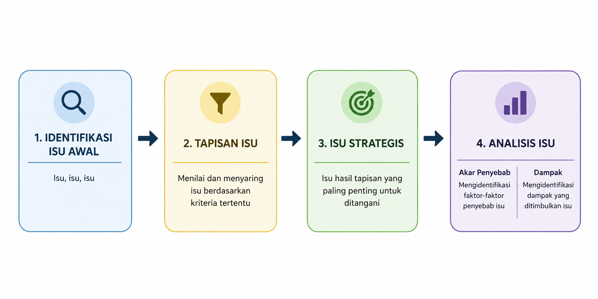

## 5.1 Pengertian Isu Strategis

Isu strategis adalah isu utama yang akan diselesaikan melalui kegiatan perencanaan. Isu strategis dirumuskan berdasarkan isu utama dari seluruh aspek yang ditinjau secara komprehensif. Isu strategis dianalisis untuk dapat menstrukturkan urgensi yang mencakup akar permasalahan serta dampak yang dapat ditimbulkan dari keberadaan isu tersebut.

Terdapat beberapa kata kunci dari isu strategis, di antaranya: mendesak, memiliki dampak yang luas/besar, dan terkait dengan banyak aktor/pihak. Berdasarkan hal ini dapat disimpulkan bahwa apabila kita telah menentukan isu strategis, maka isu tersebut pastilah suatu hal yang sedang berlangsung, penting, dan mendesak untuk segera diselesaikan.

Sebagian besar mahasiswa mengalami kesulitan saat merumuskan isu strategis. Pertanyaan yang sering muncul: "apakah isu yang dirumuskan (dari sisi substansi) sudah tepat untuk dikatakan sebagai isu strategis perencanaan?" dan "apakah kalimat isu yang dirumuskan sudah tepat merepresentasikan isu yang akan diangkat?". Kami dapat menjawab:

1. Pastikan isu strategis memiliki bidang kajian yang luas. Selain itu, isu strategis perencanaan juga dapat terkait dengan aktivitas ekonomi masyarakat yang dominan (menjadi *core activity* bagi masyarakat) di wilayah perencanaan. Seringkali, hal ini juga telah tertuang pada tujuan perencanaan wilayah penelitian dalam berbagai dokumen perencanaan.
2. Gunakan kalimat isu yang netral dan konstruktif. Saat kalian menemukan permasalahan atau dugaan isu: rendahnya daya saing pertanian, alih-alih menuliskan kalimat isunya sebagai: "rendahnya daya saing pertanian Kecamatah X..." gunakanlah: "perlunya peningkatan daya saing pertanian di Kecamatan X...". Kalimat yang netral lebih mudah diterima oleh berbagai pihak. Hal ini juga sesuai dengan konteks kita bahwa 'isu adalah hal yang belum tervalidasi'.

Analogi sederhana, terdapat beberapa contoh isu strategis:

- Isu strategis 1: "Perlunya peningkatan angka melek huruf masyarakat di Kecamatan X"
- Isu strategis 2: "Perlunya pemantauan terhadap penggunaan dana desa di Kecamatan Y"
- Isu strategis 3: "Perlunya peningkatan daya saing pariwisata di Kecamatan Y"

*Dari ketiga isu strategis tersebut, mana yang termasuk ke dalam isu strategis perencanaan?*

Isu strategis 1 → sulit untuk disebut sebagai isu strategis perencanaan. *Mengapa?* Karena ruang lingkup isu sangat kecil, hanya membahas angka melek huruf yang menjadi salah satu karakter dari komponen sumber daya manusia. Isu ini berpotensi layak apabila wilayah perencanaan kita memiliki tujuan penataan ruang sebagai kawasan masyarakat berpendidikan, tetapi tentunya akan ada pergeseran fokus ke arah substansi yang lebih umum, *misalnya perlunya peningkatan daya saing masyarakat...*

Isu strategis 2 → sama seperti isu strategis 1, ruang lingkup isu sangat kecil. Isu ini berpotensi memiliki muara yang lebih besar lagi, misalnya apakah Kecamatan Y memiliki tujuan perencanaan tertentu yang ditargetkan oleh pemerintah daerah atau pemerintah pusat, sehingga isu terkait penggunaan dana desa menjadi salah satu hambatan dari target perencanaan yang ada? Jika iya, mari kita berfokus pada muara tersebut.

Isu strategis 3 → secara umum sudah merepresentasikan isu strategis perencanaan. Tetapi perlu dipastikan lebih lanjut, apakah kegiatan pariwisata adalah kegiatan utama ekonomi wilayah? Jika ya, maka sudah cukup.

## 5.2 Tapisan Isu

**Penulis: Tetty Harahap**

### 5.2.1 Kedudukan Tapisan Isu dalam Proses Perencanaan

Setiap wilayah memiliki persoalan yang jumlahnya jauh melebihi kemampuan perencana untuk menanganinya. Pada tahap belanja isu, satu kelompok studio umumnya mengumpulkan puluhan isu dari lima aspek perencanaan—fisik lingkungan; sosial, kependudukan, dan kebudayaan; sosial ekonomi; kelembagaan dan pembiayaan; serta infrastruktur. Jika seluruhnya dibawa ke tahap analisis, waktu, data, dan tenaga akan terserap pada persoalan yang sebenarnya berpengaruh kecil terhadap masa depan wilayah. Karena itu, sesudah isu dikumpulkan, langkah berikutnya bukan menambah isu, melainkan menyaringnya.

Anderson (1995) menempatkan identifikasi isu sebagai titik masuk siklus perencanaan yang menentukan arah seluruh tahap sesudahnya: kebutuhan data, rancangan survei, hingga rumusan rekomendasi. Bryson (2018) menyebut isu strategis sebagai persoalan mendasar yang menyangkut mandat, kewenangan, dan arah pelayanan suatu wilayah, serta menegaskan bahwa tidak ada pemerintah daerah yang sanggup menangani seluruh isu sekaligus sehingga urutan perhatian harus ditetapkan secara eksplisit. Mutu perencanaan tidak hanya ditentukan oleh produk akhirnya, tetapi juga oleh kualitas proses pengambilan keputusan yang mendasarinya (UN-Habitat, 2018).

### 5.2.2 Pengertian Tapisan Isu

Tapisan isu (*issue screening* atau *issue prioritization*) adalah proses sistematis untuk menyaring daftar panjang isu hasil identifikasi awal menjadi sejumlah kecil isu prioritas, dengan kriteria yang disepakati bersama, diterapkan konsisten pada semua isu, dan dapat ditelusuri kembali oleh pihak lain. Dua kata kunci perlu digarisbawahi. Pertama, kriteria yang sama berlaku bagi semua isu, sehingga isu infrastruktur dan isu kelembagaan dinilai dengan alat ukur setara. Kedua, hasilnya dapat ditelusuri: setiap skor disertai alasan dan rujukan data, bukan sekadar kesan anggota kelompok.

Tapisan isu bukan proses menghapus isu. Isu yang tidak masuk peringkat teratas tetap dicatat sebagai konteks dan dapat naik peringkat setelah survei lapangan menghadirkan bukti baru. Tapisan juga berbeda dari analisis akar masalah seperti diagram tulang ikan atau pohon masalah (Ishikawa, 1982): tapisan menjawab "isu mana yang harus didahulukan", sedangkan analisis akar masalah menjawab "mengapa isu itu terjadi". Keduanya berurutan, bukan bersaing.

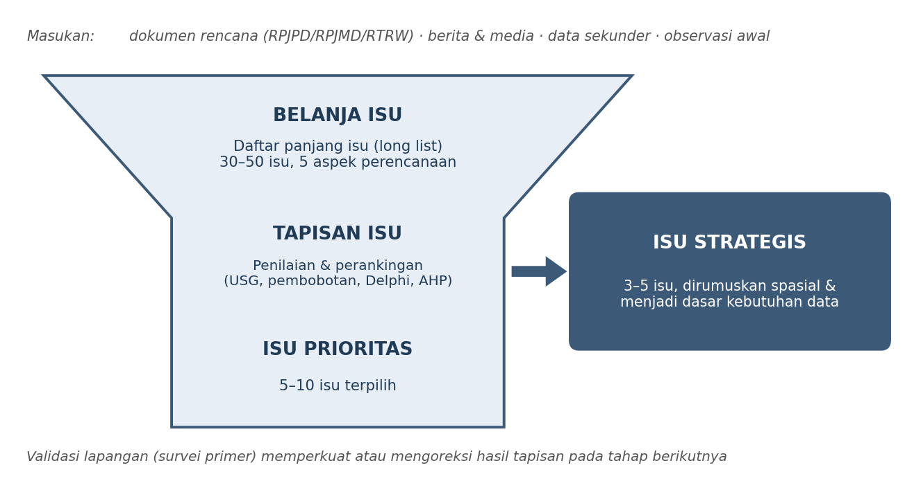

*Gambar 1. Kedudukan tapisan isu di antara belanja isu dan perumusan isu strategis*

Sebagai rambu, praktik perencanaan pembangunan daerah di Indonesia menyediakan kriteria untuk menguji apakah suatu isu layak disebut strategis, antara lain besarnya pengaruh terhadap pencapaian sasaran pembangunan, keberadaannya dalam kewenangan pemerintah daerah, luasnya dampak, daya ungkit terhadap persoalan lain, serta kemudahan penanganannya (Permendagri Nomor 86 Tahun 2017). Dalam konteks penataan ruang, isu juga perlu diperiksa keterkaitannya dengan arahan struktur dan pola ruang yang berlaku, misalnya kawasan strategis kabupaten dalam Perda RTRW setempat (Pemerintah Kabupaten Pesawaran, 2019).

### 5.2.3 Ragam Teknik Tapisan Isu

Tidak ada satu teknik yang unggul untuk semua situasi. Pilihan ditentukan oleh waktu yang tersedia, mutu data, jumlah isu, dan siapa yang dilibatkan sebagai penilai (Belton & Stewart, 2002; Dodgson dkk., 2009). Tabel 1 merangkum enam teknik yang lazim digunakan.

**Tabel 1. Perbandingan teknik tapisan isu yang lazim digunakan**

| Teknik | Prinsip dasar | Kekuatan | Keterbatasan |
| --- | --- | --- | --- |
| USG (Urgency, Seriousness, Growth) | Setiap isu dinilai pada tiga kriteria baku dengan skala ordinal 1–5, lalu dijumlahkan atau dikalikan untuk memperoleh peringkat. | Cepat, murah, mudah dipelajari, dan cocok untuk kerja kelompok studio dengan waktu terbatas. | Kriteria terbatas pada tiga dimensi; hasil sangat bergantung pada mutu rubrik dan bukti pendukung. |
| Skoring dan pembobotan (analisis multikriteria sederhana) | Kriteria disusun sendiri sesuai konteks wilayah, masing-masing diberi bobot, lalu skor total dihitung sebagai penjumlahan terboboti. | Fleksibel; kriteria dapat disesuaikan dengan karakter wilayah dan kelima aspek perencanaan. | Penetapan bobot rawan subjektif bila tidak didasarkan pada argumen dan kesepakatan yang terdokumentasi. |
| AHP (Analytic Hierarchy Process) | Bobot kriteria diturunkan dari perbandingan berpasangan antar-kriteria, disertai pengukuran rasio konsistensi penilaian. | Bobot lebih dapat dipertanggungjawabkan karena konsistensi penilai diuji secara kuantitatif. | Perhitungan relatif rumit dan jumlah perbandingan membengkak bila isu dan kriteria terlalu banyak. |
| Delphi | Penilaian dilakukan oleh panel ahli secara anonim dalam beberapa putaran; hasil setiap putaran diumpanbalikkan hingga penilaian mengerucut. | Mengurangi dominasi peserta yang paling vokal dan menampung keahlian lintas bidang. | Butuh waktu panjang dan ketersediaan narasumber ahli yang bersedia mengikuti beberapa putaran. |
| Teknik Kelompok Nominal (NGT) | Peserta menuliskan gagasan secara mandiri, memaparkannya bergiliran, lalu memberi peringkat terhadap daftar gabungan. | Terstruktur, dapat diselesaikan dalam satu sesi, dan setiap suara memiliki bobot setara. | Hanya menghasilkan urutan preferensi, tanpa penjelasan mengapa suatu isu dinilai lebih penting. |
| Matriks kepentingan–pengaruh pemangku kepentingan | Isu dipetakan menurut tingkat kepentingan bagi pemangku kepentingan dan besar pengaruh mereka terhadap penanganannya. | Menempatkan isu dalam peta aktor sehingga terlihat siapa yang harus dilibatkan sejak awal. | Memerlukan pemetaan pemangku kepentingan yang memadai, yang belum tentu tersedia pada tahap awal studio. |

Untuk Studio Dasar Perencanaan, USG dipilih sebagai teknik utama karena dapat diselesaikan dalam satu sesi kerja kelompok, tidak menuntut perhitungan rumit, dan memaksa mahasiswa membedakan tiga dimensi yang sering tercampur: seberapa cepat isu harus ditangani, seberapa besar akibatnya, dan seberapa cepat ia memburuk. AHP (Saaty, 1980, 2008), Delphi (Dalkey & Helmer, 1963; Linstone & Turoff, 1975), teknik kelompok nominal (Delbecq dkk., 1975), dan matriks pemangku kepentingan (Bryson, 2004) dapat dipakai sebagai pelengkap atau pembanding.

### 5.2.4 Teknik USG: Urgency, Seriousness, Growth

Teknik USG berakar pada kerangka penilaian situasi yang dikembangkan Kepner dan Tregoe, yang menilai prioritas persoalan melalui tiga pertanyaan: seberapa serius akibatnya, seberapa mendesak waktunya, dan seberapa cepat persoalan itu berkembang (Kepner & Tregoe, 1981). Kerangka ini kemudian diadopsi luas dalam pelatihan aparatur dan praktik perencanaan di Indonesia (Lembaga Administrasi Negara, 2019). Dalam berbagai literatur berbahasa Indonesia, teknik ini kadang ditulis dengan urutan huruf yang berbeda, misalnya UGS; komponen dan cara kerjanya tetap sama.

- Urgency (kemendesakan). Dimensi waktu. Seberapa cepat isu harus ditangani sebelum peluang penanganan hilang atau biaya penanganan melonjak. Pertanyaan penuntun: apa yang terjadi bila isu ini baru ditangani lima tahun lagi?
- Seriousness (kegawatan). Dimensi dampak. Seberapa besar dan luas akibat yang ditimbulkan bila isu dibiarkan, diukur dari jumlah penduduk terdampak, nilai kerugian, keterkaitan dengan aspek lain, dan dapat atau tidaknya kondisi dipulihkan.
- Growth (perkembangan). Dimensi kecenderungan. Seberapa cepat isu memburuk atau meluas dari waktu ke waktu, termasuk kemampuannya memicu isu turunan yang baru.

Ketiga kriteria dinilai dengan skala ordinal 1 sampai 5. Agar penilaian tidak berubah menjadi tebakan, setiap angka harus diberi makna lebih dahulu melalui rubrik seperti Tabel 2. Rubrik ini dapat disesuaikan dengan karakter wilayah studi, sepanjang penyesuaiannya disepakati dan dituliskan sebelum penilaian dimulai.

**Tabel 2. Contoh rubrik penilaian skala 1–5 untuk kriteria USG**

| Skor | Urgency (U) — Kemendesakan waktu | Seriousness (S) — Kegawatan dampak | Growth (G) — Kecenderungan berkembang |
| --- | --- | --- | --- |
| 5 | Harus ditangani segera; penundaan satu tahun sudah menimbulkan kerugian yang sulit dipulihkan. | Dampak sangat luas, lintas aspek, menyangkut keselamatan jiwa atau keberlanjutan lingkungan. | Memburuk sangat cepat dan sudah memicu munculnya isu turunan baru. |
| 4 | Perlu ditangani dalam waktu dekat; peluang penanganan menyempit bila ditunda. | Dampak luas pada satu wilayah kecamatan atau beberapa desa dan sulit dipulihkan. | Kecenderungan memburuk terlihat jelas pada data lima tahun terakhir. |
| 3 | Dapat dijadwalkan dalam rencana jangka menengah tanpa kerugian besar. | Dampak dirasakan sebagian penduduk dan masih dapat dipulihkan. | Memburuk perlahan dan relatif dapat diperkirakan. |
| 2 | Dapat ditunda karena tidak ada tekanan waktu yang berarti. | Dampak terbatas pada kelompok atau lokasi tertentu. | Cenderung stabil, perubahan tidak signifikan. |
| 1 | Tidak mendesak; penanganan dapat menunggu isu lain selesai. | Dampak sangat kecil dan bersifat sementara. | Cenderung menurun dengan sendirinya. |

Skor total dihitung dengan menjumlahkan ketiga nilai (Total = U + S + G, rentang 3–15). Alternatifnya, ketiga nilai dikalikan (Total = U × S × G, rentang 1–125) untuk memperbesar jarak antar-isu, atau dijumlahkan secara terboboti bila salah satu kriteria dinilai lebih penting bagi konteks wilayah. Apa pun pilihannya, rumus ditetapkan sebelum penilaian, bukan sesudah melihat hasilnya.

#### 5.2.4.1 Langkah-langkah Penerapan

Gambar 2 meringkas enam langkah penerapan teknik USG. Uraian setiap langkah diberikan sesudahnya.

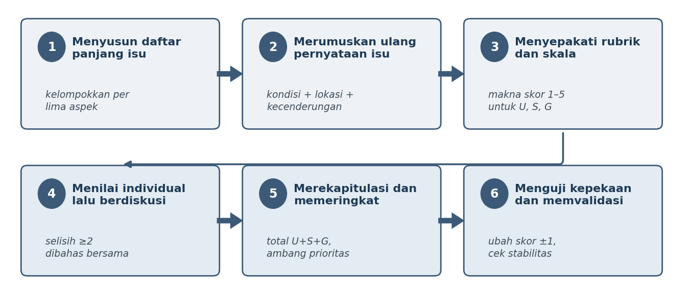

*Gambar 2. Enam langkah penerapan teknik USG dalam tapisan isu*

1. Menyusun daftar panjang isu. Salin hasil belanja isu ke dalam tabel dan kelompokkan menurut lima aspek perencanaan. Setiap baris memuat satu isu beserta lokasi, sumber, dan tahun data. Bila satu aspek hanya berisi satu atau dua isu, kembali ke penelusuran sumber agar tapisan tidak berjalan di atas daftar yang timpang.
2. Merumuskan ulang pernyataan isu. Isu ditulis sebagai kondisi, bukan solusi. Rumusan "belum ada tempat pemrosesan akhir sampah" adalah solusi yang disamarkan; rumusan yang tepat adalah "timbulan sampah rumah tangga tidak terkelola dan menumpuk di saluran drainase permukiman". Pola yang dianjurkan: kondisi terukur + lokasi + kecenderungan. Hindari isu ganda dalam satu kalimat karena menyulitkan pemberian satu skor.
3. Menyepakati rubrik dan skala. Sebelum menilai, kelompok menyalin atau menyesuaikan rubrik pada Tabel 2, menetapkan rumus agregasi, dan bila perlu menyepakati bobot antar-kriteria. Kesepakatan ini dilampirkan dalam laporan sebagai bagian dari metodologi.
4. Menilai secara individual lalu mendiskusikan. Setiap anggota mengisi lembar penilaian sendiri tanpa berdiskusi lebih dahulu agar penilaian tidak terseret anggota yang paling vokal. Hasil kemudian dibandingkan; selisih dua tingkat atau lebih wajib dibahas sampai tercapai kesepakatan dan alasannya dicatat. Tingkat kesepakatan antar-penilai dapat diperiksa dengan koefisien konkordansi Kendall (Siegel & Castellan, 1988).
5. Merekapitulasi dan memeringkat. Hitung skor total setiap isu, urutkan dari yang tertinggi, lalu tetapkan ambang batas isu prioritas, misalnya lima isu teratas atau seluruh isu dengan skor minimal dua belas. Pastikan isu terpilih tetap mewakili kelima aspek.
6. Menguji kepekaan dan memvalidasi. Naikkan atau turunkan skor isu teratas satu tingkat, lalu periksa apakah peringkatnya berubah. Peringkat yang bergeser hanya karena perubahan satu angka menandakan hasil yang belum kukuh dan perlu bukti tambahan. Selanjutnya konfirmasi hasil kepada data sekunder, dokumen rencana, dan narasumber di wilayah studi.

#### 5.2.4.2 Contoh Penerapan pada Lima Aspek

Tabel 3 memperagakan hasil tapisan untuk satu isu terpilih dari setiap aspek pada sebuah kecamatan pesisir. Angka pada tabel bersifat ilustratif untuk keperluan latihan dan tidak boleh disalin ke laporan tanpa penilaian ulang berdasarkan data wilayah studi masing-masing.

**Tabel 3. Contoh rekapitulasi penilaian USG lintas lima aspek perencanaan (ilustratif)**

| Aspek | Pernyataan isu | U | S | G | Total | Peringkat |
| --- | --- | --- | --- | --- | --- | --- |
| Fisik lingkungan | Meluasnya lahan kritis pada lereng atas akibat alih fungsi lahan hutan menjadi kebun campuran | 4 | 5 | 4 | 13 | II |
| Sosial, kependudukan, dan kebudayaan | Rendahnya rata-rata lama sekolah penduduk usia produktif dibandingkan rata-rata kabupaten | 3 | 4 | 3 | 10 | IV |
| Sosial ekonomi | Ketergantungan ekonomi pada perikanan tangkap skala kecil dengan nilai tambah rendah | 4 | 4 | 4 | 12 | III |
| Kelembagaan dan pembiayaan | Belum adanya lembaga pengelola bersama kawasan wisata pesisir antar-desa | 3 | 3 | 3 | 9 | V |
| Infrastruktur | Rendahnya cakupan layanan air minum perpipaan pada permukiman pesisir | 5 | 5 | 4 | 14 | I |

Setiap angka pada Tabel 3 wajib disertai justifikasi satu sampai dua kalimat beserta sumber datanya pada lampiran laporan. Isu air minum menempati peringkat pertama karena mendesak, berdampak luas pada kesehatan, sekaligus terus meluas seiring pertumbuhan permukiman. Isu kelembagaan berada di peringkat terakhir bukan karena tidak penting, melainkan karena tekanan waktunya lebih longgar. Peringkat adalah bahan diskusi, bukan vonis: kelompok tetap perlu menjelaskan keterkaitan antar-isu, misalnya bahwa lemahnya kelembagaan pengelola kawasan justru dapat menjadi penyebab bertahannya isu di peringkat atas.

### 5.2.5 Catatan Kritis dan Kesalahan yang Sering Terjadi

- Angka tanpa bukti. Skor yang tidak disertai rujukan data hanya menghasilkan kesan objektif, bukan penilaian yang dapat diuji.
- Isu ditulis sebagai solusi. Rumusan seperti "perlu pembangunan jalan baru" menutup ruang analisis karena jawabannya sudah ditetapkan sebelum persoalannya dipahami.
- Efek langit-langit. Bila hampir semua isu diberi skor 4 dan 5, tapisan kehilangan daya pembeda. Gunakan seluruh rentang skala dan bandingkan isu satu sama lain.
- Bias pembagian tugas. Anggota yang menangani satu aspek cenderung menaikkan skor isu pada aspeknya sendiri. Terapkan penilaian silang antar-anggota untuk menekan bias ini.
- Batas kemampuan teknik. USG tidak menilai kewenangan penanganan, ketersediaan pembiayaan, maupun penerimaan masyarakat. Bila hal itu penting bagi wilayah studi, tambahkan kriteria melalui skoring berbobot.
- Menganggap hasil bersifat final. Hasil tapisan pada tahap ini masih berbasis data sekunder dan berstatus *hipotesis kerja*. Survei lapangan pada modul berikutnya dapat menguatkan, menggeser, atau membatalkannya.

## 5.3 Analisis Isu

### 5.3.1 Analisis Fishbone

Analisis fishbone (seringkali disebut *Ishikawa diagram*) menggunakan ilustrasi bentuk tulang ikan untuk menunjukkan konsepsi suatu permasalahan berdasarkan akar-akar penyebabnya. Analisis *fishbone* memiliki fokus untuk mengelaborasi penyebab terjadinya suatu masalah (tulang ikan) dalam sudut pandang yang komprehensif sehingga masalah yang diungkapkan pada ujung (kepala ikan) terkonfirmasi. Analisis *fishbone* dapat menunjukkan bagaimana suatu masalah/dampak/kondisi dapat terbentuk akibat rangkaian kondisi secara simultan. Setiap masalah/dampak/kondisi akan diuraikan secara menyeluruh berdasarkan kategori-kategori tertentu sesuai dengan kebutuhan penyelesaian masalah. Analisis *fishbone* biasa digunakan pada kasus industri manufakturing dan jasa dengan kategori sebagai berikut:

1. *Method* (metode/proses yang dilakukan/prosedur)
2. *Material* (bahan baku/informasi/material)
3. *Man* (kemampuan karyawan/SDM)
4. *Machine*/*Tools* (peralatan/alat/instrumen yang digunakan)

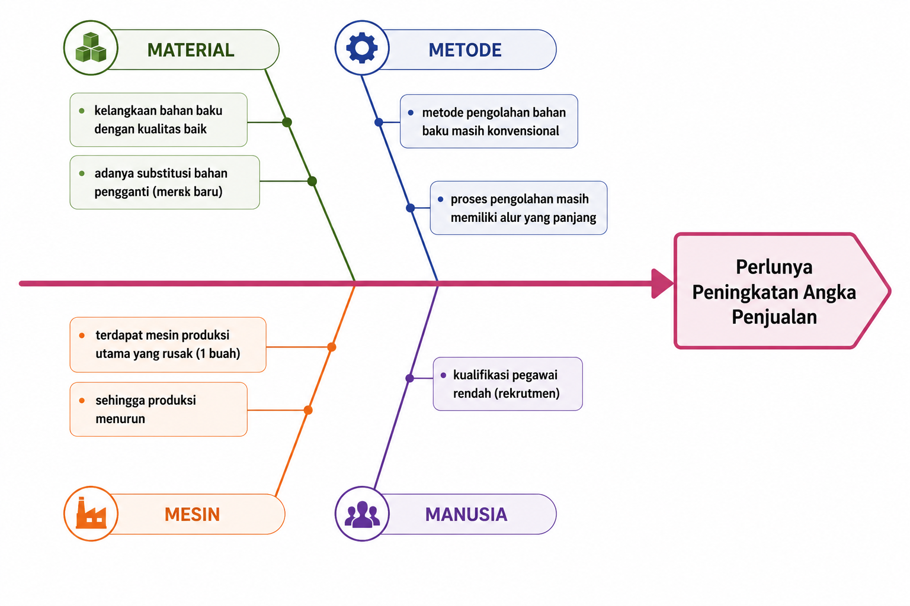

**Untuk digunakan dalam kasus perencanaan, fishbone dapat dimodifikasi sesuai dengan kebutuhan, seperti aspek perencanaan yang menjadi fokus analisis.**

**Cara mengkaji dan mengklarifikasi:**

Setelah seluruh akar masalah/penyebab dirumuskan, perlu diidentifikasi kembali: "mengapa ini bisa terjadi?" "apakah ada hal lain yang menyebabkan masalah ini muncul?" terus lakukan kembali terhadap akar masalah sehingga tidak ada jawaban lain. Jawaban akhir itulah yang kemudian menjadi akar masalah utama yang dihadapi.

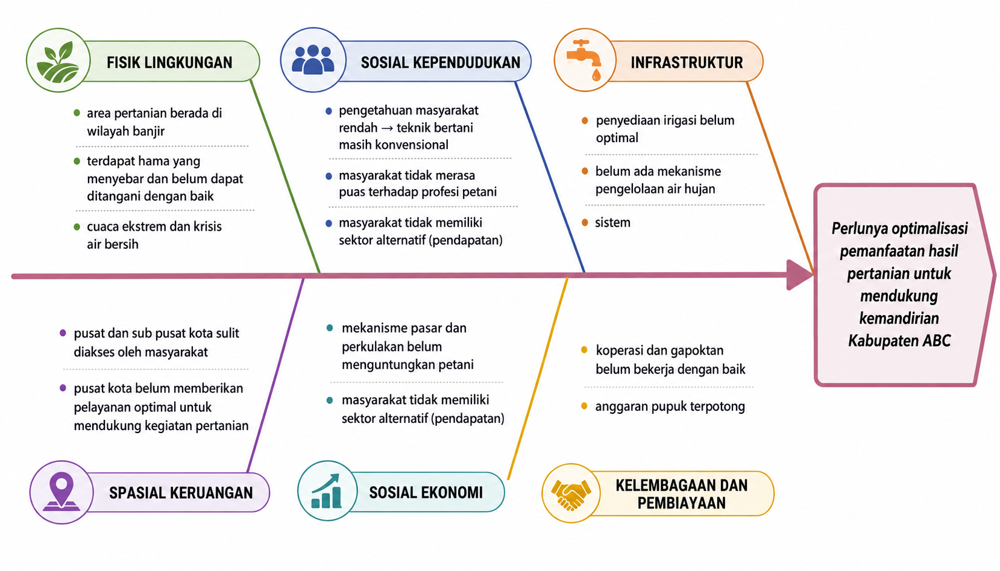

### 5.3.2 Analisis Pohon Masalah

Pohon masalah adalah salah satu analisis yang dapat digunakan untuk menstrukturkan masalah dengan bentuk ilustrasi diagram berupa pohon. Akar permasalahan diilustrasikan sebagai akar yang berada di bawah dan dampak/konsekuensi/eksternalitas ditempatkan pada bagian daun/buah yang ada di bagian atas. Pada bagian tengah, isu/masalah diungkapkan dengan ilustrasi sebagai batang pohon. Pohon masalah dapat menunjukkan konsepsi utuh dari sebuah isu/permasalahan yang mencakup dampak serta akar penyebabnya. Akar penyebab dapan diidentifikasi sampai dengan level tertentu hingga seluruh penyebab teridentifikasi.

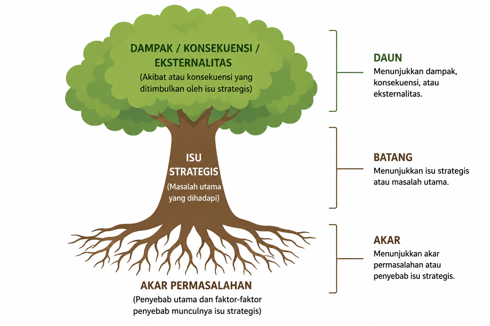

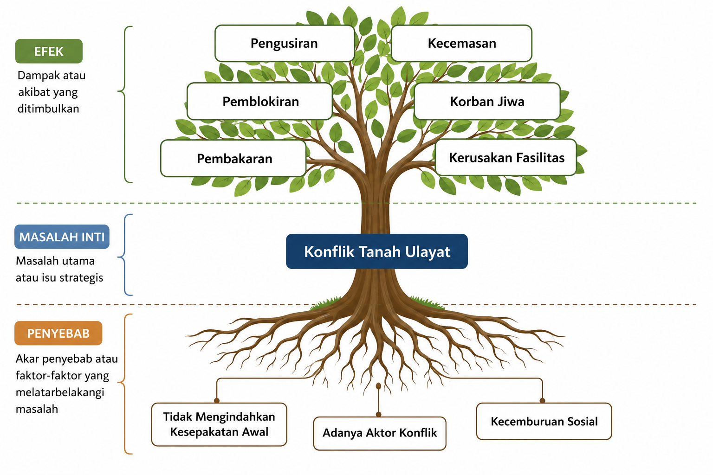

Sumber: Anas, Dewi, dan Indrawadi (2019),
*diolah kembali menggunakan Chatgpt*

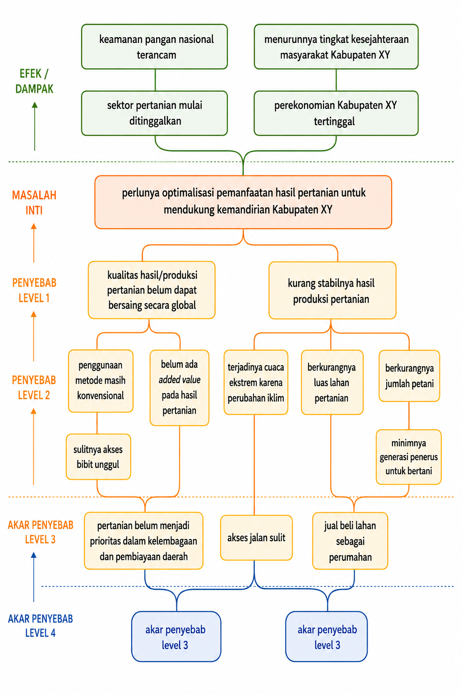

### 5.3.3 Mindmapping

Mindmap atau peta masalah adalah salah satu pendekatan yang dapat digunakan untuk mengelaborasi suatu ide; gagasan; pemikiran dengan mendalam. Mindmap merefleksikan bagaimana pemikiran manusia bekerja terkait suatu topik atau fokus. Mindmap dapat digunakan untuk menstrukturkan masalah secara komprehensif dan mendalam sehingga kemudian seringkali digunakan sebagai salah satu instrumen untuk melakukan pemecahan masalah, termasuk masalah-masalah dalam kasus perencanaan wilayah dan kota.

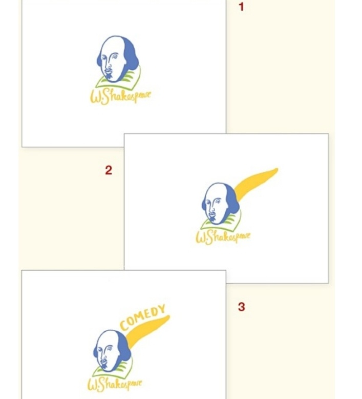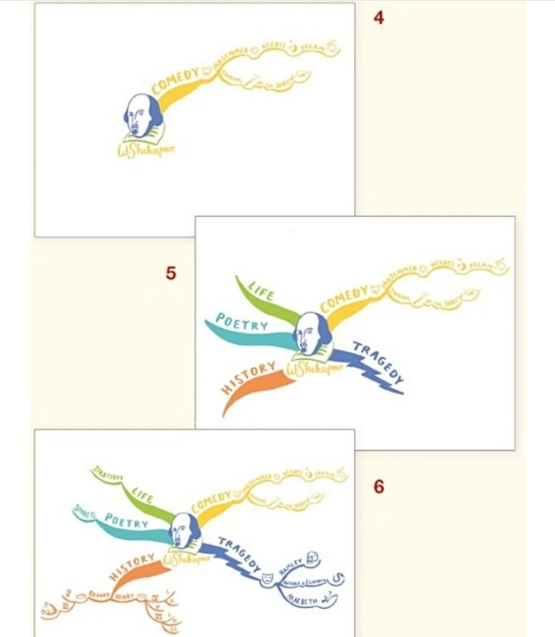

**Ilustrasi Proses Membuat Mind Map (*Mindmapping Process*)** (Buzan, 2018)

Proses *mindmapping* dapat dilakukan secara manual atau menggunakan berbagai software tertentu. Cara kerja *mindmapping* dimulai dengan menentukan ide/topik/isu/gagasan utama yang akan dielaborasi. Ide pokok ini ditempatkan pada tengah-tengah yang kemudian dilanjutkan dengan cabang-cabang yang berisi turunan pemikiran seperti: "*mengapa hal tersebut bisa terjadi? apa yang mempengaruhi hal tersebut? apa dampaknya? siapa saja aktor yang telibat? apakah terdapat pola tertentu? bagaimana proses terjadinya?..............dsb*"

Turunan pemikiran ini dapat berupa apapun yang dapat disesuaikan dengan kebutuhan. Setiap pemikiran dapat diturunkan kembali ke dalam cabang-cabang sehingga setiap ujung cabang tidak dapat diidentifikasi kembali.

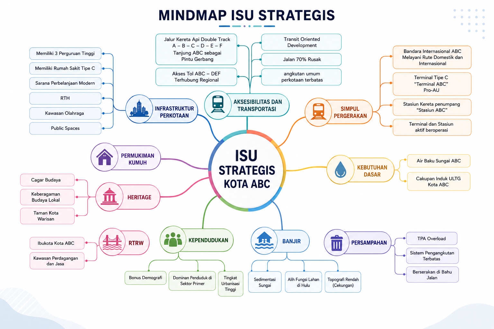

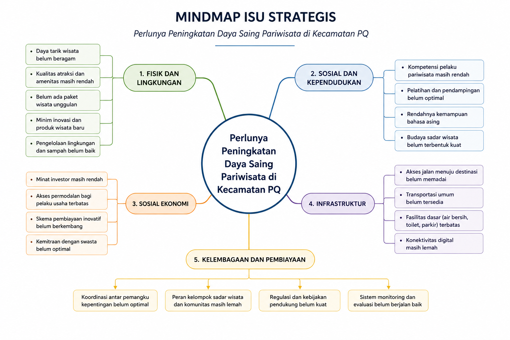
