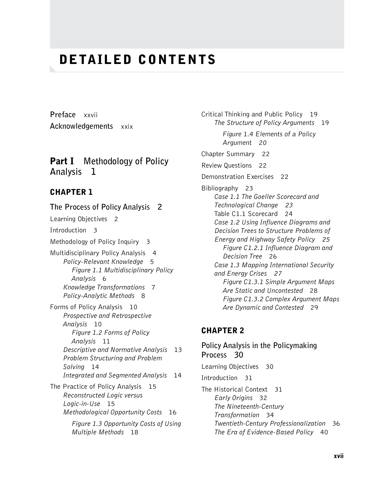

# Detailed Contents

> Sumber: *Public Policy Analysis: An Integrated Approach* (William N. Dunn, 2017) — halaman PDF 18–27.

<!-- hal. PDF 18 -->

***Figure 1.4 Elements of a Policy Argument  20 Chapter Summary  22***

***Figure 1.3 Opportunity Costs of Using Multiple Methods  18***

<!-- hal. PDF 19 -->

***Figure 3.1 The Process of Problem Structuring  71***

***Figure 2.1 Complexity, Feedback, and Short Circuiting in the Policymaking Process  46 Models of Policy Change  47 The Comprehensive Rationality Model  47 Second-Best Rationality  48 Table 2.2 The Voters’ Paradox  49 Disjointed Incrementalism  50 Bounded Rationality  50 Erotetic Rationality  51 Simultaneous Convergence  52 Punctuated Equilibrium  53***

<!-- hal. PDF 20 -->
> Detailed Contents xix

***Figure 3.10 Set Union  95 Figure 3.11 Set Intersection  96 Figure 3.12 Classification Scheme  96 Figure 3.13 Cross break  96 Hierarchy Analysis  96 Figure 3.14 Hierarchy Analysis of the Causes of Fires  98 Synectics  99 Brainstorming  100 Multiple Perspective Analysis  102 Assumptional Analysis  104 Figure 3.15 The Process of Assumptional Analysis  105 Argument Mapping  106 Figure 3.16 Plausibility and Importance of Warrant about Opportunity Costs of Driving at Lower Speeds  107***

***Figure 4.1 Processes of Intuition (System I) and Reasoning (System II)  120 Limitations of Forecasting  121 Societal Futures  123 Figure 4.2 Three Types of Societal Futures: Potential, Plausible, and Normative  124***

> Approaches to Forecasting  124 Aims and Bases of Forecasts  124 Figure 4.3 The Logic of Trend Extrapolation: Inductive Reasoning  126 Figure 4.4 The Logic of Theoretical Prediction: Deductive Reasoning  127 Figure 4.5 The Logic of Possible Futures: Abductive Reasoning  127 Choosing Methods and Techniques  128

> Chapter Summary  108

***Table 4.1 Three Approaches to Forecasting  128 Extrapolative Forecasting  129 Classical Time-Series Analysis  129 Figure 4.6 Demonstration of a Secular Trend: Total Arrests per 1,000 Persons in Chicago, 1940–1970  130 Figure 4.7 Demonstration of Cyclical Fluctuations: Total Arrests per 1,000 Persons in Chicago, 1868–1970  131 Linear Trend Estimation  131 Figure 4.8 Two Properties of Linear Regression  132 Table 4.2 Time-Series Data on Total Energy Consumption Used in Linear Regression  133 Table 4.3 Linear Regression with an Even-Numbered Series  135 Exhibit 4.1 SPSS Output for Tables 4.2 and 4.3  136 Nonlinear Time Series  137 Figure 4.9 Five Classes of Nonlinear Time Series  138 Figure 4.10 Growth of Federal Government Organizations in the***

> Review Questions  108

> Demonstration Exercises  108

> Bibliography  109 Exhibit 3.1 Policy Stakeholder Analysis: The Affordable Care Act (Obamacare)  110 Case 3.1 Structuring Problems of Risk: Safety in Mines and on Highways  112 Figure C3.1 Pareto Chart—Cumulative Frequency of Rival Causes  114 Figure C3.2 Pareto Chart—Cumulative Frequency of Criteria for Evaluating Research on Risk  116 Case 3.2 Brainstorming across Disciplines: The Elevator Problem  116

> CHAPTER 4

Forecasting Expected Policy Outcomes  118

> Learning Objectives  118

> Introduction  119

> Forecasting in Policy Analysis  119 The Value of Forecasting  120

<!-- hal. PDF 21 -->
> Detailed Contents xx

> United States by Presidential Term, 1789–1973  139 Figure 4.11 Linear versus Growth Trends  141 Exponential Weighting  142 Data Transformation  142 Table 4.4 Square Root and Logarithm of a Time Series Exhibiting Rapid Growth  144 Catastrophe Methodology  145 Table 4.5 Linear Regression with Logarithmic Transformation of Time Series  146

> and Feasibility of Drug-Control Objectives  170 Cross-Impact Analysis  172 Table 4.10 Cross-Impact Matrix Illustrating Consequences of Mass Automobile Use  173 Table 4.11 Hypothetical Illustration of the First Round (Play) in a Cross-Impact Matrix  175 Feasibility Forecasting  176 Table 4.12 Feasibility Assessment of Two Fiscal Policy Alternatives  178

> Evidence-Based Forecasting  180

> Theoretical Forecasting  147 Theory Mapping  148 Figure 4.12 Four Types of Causal Arguments  149 Figure 4.13 Arrow Diagram Illustrating the Causal Structure of an Argument  152 Theoretical Modeling  152 Causal Modeling  153 Figure 4.14 Path Diagram Illustrating a Model of Public Choice Theory  154 Regression Analysis  155 Figure 4.15 Scatterplot Illustrating Different Patterns and Relations between Hypothetical Annual Maintenance Costs and Annual Mileage per Vehicle  157 Table 4.6 Worksheet for Estimating Future Maintenance Costs from Annual Mileage per Vehicle  159 Point and Interval Estimation  160 Table 4.7 Calculation of Standard Error of Estimated Maintenance Costs  161 Correlational Analysis  162 Exhibit 4.2 SPSS Output for Table 4.7  164

***Table 4.13 Recommendations for Evidence-Based Forecasting  180 Chapter Summary  181 Review Questions  181 Demonstration Exercises  182***

> Bibliography  182 Case 4.1 Visual Signatures in Regression Analysis: The Anscombe Quartet  184 Figure C4.1.1 The Anscombe Quartet  184 Case 4.2 Forecasting MARTA Receipts  185 Table C4.2.1 MARTA Receipts, 1973–2014  185 Case 4.3 Multimethod Forecasting: Syria Chemical Weapons  187 Figure C4.3.1 Multimethod Forecast of Chemical Weapons in Syria  187

> CHAPTER 5

Prescribing Preferred Policies  189

> Judgmental Forecasting  164 The Delphi Technique  165 Table 4.8 Types of Items and Scales Used in a Policy Delphi Questionnaire  169 Table 4.9 Hypothetical Responses in First-Round Policy Delphi: Desirability

> Learning Objectives  189

> Introduction  190

> Prescription in Policy Analysis  190 Prescription and Policy Advocacy  190 A Simple Model of Choice  191

<!-- hal. PDF 22 -->

![Figure 5.6 Objectives Tree for National Energy Policy  221 Values Clarification  222 Values Critique  223 Figure 5.7 Value-Critical Discourse  224 Cost Element Structuring  225 Table 5.7 Cost Element Structure  225 Figure 5.8 Simplified Partial Cost Model for Total Initial Investment  227 Cost Estimation  226 Shadow Pricing  226 Constraints Mapping  228 Cost Internalization  229 Figure 5.9 Constraints Map for National Energy Policy  230 Discounting  231 Table 5.8 Internal, External, and Total Costs of Maternal Care  231 Figure 5.10 Comparison of Discounted and Undiscounted Costs Cumulated for Two Programs with Equal Effectiveness  232 Table 5.9 Calculation of Present Value of Cost Stream at 10 Percent Discount Rate over 5 Years (in Millions of Dollars)  234 Sensitivity Analysis  235 Plausibility Analysis  235 Table 5.10 Sensitivity Analysis of Gasoline Prices on Costs of Training Programs  236 Figure 5.11 Threats to the Plausibility of Claims about the Benefits of the 55 mph Speed Limit  237](gambar/figure_5_6.png)

***Figure 5.6 Objectives Tree for National Energy Policy  221 Values Clarification  222 Values Critique  223 Figure 5.7 Value-Critical Discourse  224 Cost Element Structuring  225 Table 5.7 Cost Element Structure  225 Figure 5.8 Simplified Partial Cost Model for Total Initial Investment  227 Cost Estimation  226 Shadow Pricing  226 Constraints Mapping  228 Cost Internalization  229 Figure 5.9 Constraints Map for National Energy Policy  230 Discounting  231 Table 5.8 Internal, External, and Total Costs of Maternal Care  231 Figure 5.10 Comparison of Discounted and Undiscounted Costs Cumulated for Two Programs with Equal Effectiveness  232 Table 5.9 Calculation of Present Value of Cost Stream at 10 Percent Discount Rate over 5 Years (in Millions of Dollars)  234 Sensitivity Analysis  235 Plausibility Analysis  235 Table 5.10 Sensitivity Analysis of Gasoline Prices on Costs of Training Programs  236 Figure 5.11 Threats to the Plausibility of Claims about the Benefits of the 55 mph Speed Limit  237***

<!-- hal. PDF 23 -->
> Detailed Contents xxii

> Table C5.1 Scorecard and Spreadsheet  243 Case 5.2 Opportunity Costs of Saving Lives—The 55 mph Speed Limit  244 Table C5.2 Analysis of the Costs and Benefits of the 55 mph Speed Limit  245

***Figure 6.2 Steps in Conducting a Systematic Review or Meta-Analysis  275***

> Methods for Monitoring  276 Table 6.6 Methods Appropriate to Five Approaches to Monitoring  276 Graphic Displays  277 Figure 6.3 Two Graphic Displays of Motor Vehicle Deaths  277 Figure 6.4 Spurious and Plausible Interpretations of Data  279 Figure 6.5 Bar Graph Showing Municipal Personnel Costs Per Capita for Cities with Growing and Declining Populations and for New York City  279 Table 6.7 Grouped Frequency Distribution: Number of Persons below the Poverty Threshold by Age Group in 1977  280 Figure 6.6 Histogram and Frequency Polygon: Number of Persons below the Poverty Threshold by Age Group in 1977  280 Figure 6.7 Lorenz Curve Showing the Distribution of Family Personal Income in the United States in 1975 and 1989  281 The Gini Index  282 Table 6.8 Computation of Gini Concentration Ratio for Violent Crimes Known to Police per 100,000 Persons in 1976  283 Tabular Displays  284 Index Numbers  284 Table 6.9 Poverty Rates in 1968, 1990, and 2006 by Age and Race  284 Table 6.10 Number of Drunk Driving Re-arrests in Treatment and Control Groups  285 Table 6.11 Use of Consumer Price Index (1982–1984 = 100) to Compute Purchasing Power Index  286 Table 6.12 Real Weekly Wages in the U.S., 2001–2010  287 Table 6.13 Maximum Concentration of Pollutants Reported in Chicago,

> CHAPTER 6

Monitoring Observed Policy Outcomes  250

> Learning Objectives  250

> Introduction  251

> Monitoring in Policy Analysis  251 Sources of Information  252 Policy-Relevant Causes and Effects  254 Figure 6.1 Causal Mechanism: Inputs, Activities, Outputs, Outcomes, and Impacts  255 Definitions and Indicators  255 Table 6.1 Inputs, Activities, Outputs, Outcomes, and Impacts in Three Issue Areas  256 Approaches to Monitoring  257

***Table 6.2 Contrasts among Six Approaches to Monitoring  258 Social Systems Accounting  259 Table 6.3 Some Representative Social Indicators  261 Policy Experimentation  263 Social Auditing  268 Research and Practice Synthesis  270 Table 6.4 Sample Case-Coding Scheme: Representative Indicators and Coding Categories  271 Table 6.5 Research Survey Method: Empirical Generalizations, Action Guidelines, and Levels of Confidence in Generalizations  272 Systematic Reviews and Meta-Analyses  273***

<!-- hal. PDF 24 -->
> Detailed Contents xxiii

> Philadelphia, and San Francisco for Averaging Times of 5 Minutes and 1 Year  288 Table 6.14 Implicitly Weighted Aggregative Quantity Index to Measure Changes in Pollutants in the United States, 1970–1975  289 Table 6.15 Duration of Exposure to Pollutants and Consequent Damage to Health and the Environment  290 Effect Sizes  291 Table 6.16 Calculation of Odds-Ratio (Using Data from Table 6.10)  292 Table 6.17 Calculation of Binary Effect Size Display (BESD) and Risk-Ratio (R-R)  292 Table 6.18 Calculation of Standardized Mean Difference (Cohen’s d)  293 Interrupted Time-Series Analysis  294 Figure 6.8 Interrupted Time Series Showing Effects and No Effects  295 Figure 6.9 Connecticut Traffic Deaths before and after the 1956 Crackdown on Speeding  296 Figure 6.10 Extended Time-Series Graph  297 Figure 6.11 Control-Series Graph  298 Figure 6.12 Threats to Validity as Objections to the Argument That the Speeding Crackdown Was Worthwhile  300 Regression-Discontinuity Analysis  300 Table 6.19 Worksheet for Regression and Correlation: Investment in Training Programs and Subsequent Employment of Trainees  301 Exhibit 6.1 SPSS Output for Table 6.19  302 Figure 6.13 Tie-Breaking Experiment  304

***Table 6.20 Distribution of Cities by Scores on a Hypothetical Index of Pollution Severity  305 Table 6.21 Results of Regression-Discontinuity Analysis for Hypothetical Experimental and Control Cities  306 Exhibit 6.2 SPSS Output for Tables 6.13 and 6.14  308 Figure 6.14 Results of Regression-Discontinuity Analysis  310 Chapter Summary  311***

> Review Questions  311 Table 6.22 Crimes Committed in the United States: Offenses Known to Police per 100,000 Persons, 1985–2009  312 Table 6.23 Murders in New York City, 1985–2009  312 Table 6.24 Percentage Distribution of Family Personal Income in the United States by Quintiles, 1975, 1989, 2006, 2015  312

> Demonstration Exercise  314

> Bibliography  316 Case 6.1 Monitoring Policy Outcomes: The Political Economy of Traffic Fatalities in Europe and the United States  317 Exhibit C6.1 Fatalities and Other Variables in the United States, 1966–2015  318 Exhibit C6.2 Fatalities per 100,000 Persons, 1970–1976  319

> CHAPTER 7

Evaluating Policy Performance  320

> Learning Objectives  320

> Introduction  321

> Ethics and Values in Policy Analysis  321 Thinking about Values  322 Ethics and Meta-ethics  324 Standards of Conduct  326

<!-- hal. PDF 25 -->
> Detailed Contents xxiv

> Descriptive Ethics, Normative Ethics, and Meta-ethics  327 Descriptive Value Typologies  327 Table 7.1 Basic Value Typology: Terminal and Instrumental Values  328 Developmental Value Typologies  328 Normative Theories  329 Meta-ethical Theories  330

> Introduction  349

> The Structure of Policy Arguments  349 Figure 8.1 Structure of a Policy Argument  350 Types of Knowledge Claims  351 Policy Maps  352 Figure 8.2 Argument Map—Privatizing Transportation  352 Exhibit 8.1 Identifying and Arranging Elements of a Policy Argument  353

> Evaluation in Policy Analysis  331 The Nature of Evaluation  331 Functions of Evaluation  332 Criteria for Policy Evaluation  332 Table 7.2 Criteria for Evaluation  333

> Modes of Policy Argumentation  354 Argumentation from Authority  354 Table 8.1 Modes of Policy Argumentation with Reasoning Patterns  355 Argumentation from Method  356 Figure 8.3 Argumentation from Authority—Unintended Consequences of the U.S.–NATO Attack on Serbia  357 Figure 8.4 Argumentation from Method—Intransitivity of Preferences for Nuclear Power  358 Argumentation from Generalization  360 Figure 8.5 Argumentation from Generalization—A “False Positive” About the Success of Community Nutrition  361 Argumentation from Classification  362 Figure 8.6 Argumentation from Classification—Challenging Claims about Authoritarian Rule and Terrorism  363 Argumentation from Cause  363 Figure 8.7 Argumentation from Theoretical Cause—Competing Deductive-Nomological Explanations of the Cuban Missile Crisis  365 Figure 8.8 Argumentation from Practical Cause—Rival Explanations of the Effects of the Connecticut Crackdown on Speeding  368 Argumentation from Sign  369 Figure 8.9 Argumentation from Sign—Quantitative Indicators Such as Correlation Coefficients and P-Values Do Not “Prove” Causation  370

> Approaches to Evaluation  333 Table 7.3 Three Approaches to Evaluation  334 Pseudo-evaluation  334 Formal Evaluation  334 Varieties of Formal Evaluation  335 Table 7.4 Types of Formal Evaluation  336 Decision-Theoretic Evaluation  338

> Methods for Evaluation  341 Table 7.5 Techniques for Evaluation by Three Approaches  342 Table 7.6 Interview Protocol for User-Survey Analysis  342

> Chapter Summary  343

> Review Questions  343

> Demonstration Exercise  343

> Bibliography  343 Case 7.1 The Ethics of Cake Cutting  344 Case 7.2 The Economics of Morality: Evaluating Living Wage Policies  345 Table C7.2.1 Hourly Wages  345 Table C7.2.2 Monthly Expenses  346

Part III  Methods of Policy Communication  347

> CHAPTER 8

Developing Policy Arguments  348

> Learning Objectives  348

<!-- hal. PDF 26 -->
> Detailed Contents xxv

> CHAPTER 9

> Argumentation from Motivation  371 Figure 8.10 Argumentation from Motivation—Support for the Equal Rights Amendment  372 Argumentation from Intuition  373 Argumentation from Analogy  373 Figure 8.11 Argumentation from Intuition—A Counterintuitive Solution Avoids Certain Death  374 Figure 8.12 Argumentation from Analogy—The Equal Rights Amendment and False Analogy  375 Argumentation from Parallel Case  375 Figure 8.13 Argumentation from Parallel Case—The Dutch Model and False Parallel  376 Argumentation from Ethics  376 Figure 8.14 Argumentation from Ethics—Income Distribution and Justice as Fairness  377

Communicating Policy Analysis  391

> Learning Objectives  391

> Introduction  392

> The Process of Policy Communication  392 Box 9.1 Producing Policy Analysis— A Poorly Managed Lumber Mill  392 Figure 9.1 The Process of Policy Communication  393 Tasks in Policy Documentation  394 Tasks in Oral Presentations and Briefings  396 Box 9.2 Contingent Communication  397

> The Policy Issue Paper  398 Issues Addressed in the Policy Issue Paper  398 Table 9.1 Two Kinds of Policy Disciplines  399 Elements of the Policy Issue Paper  399 The Policy Memorandum  400 The Executive Summary  401 The Letter of Transmittal  401 Figure 9.2 Methods for Developing a Policy Memo or Issue Paper  401 Planning the Oral Briefing and Visual Displays  402

> Evaluating Policy Arguments  378 Some Hermeneutic Guidelines  379 Exhibit 8.2 Guidelines for Interpreting Arguments  380

> Guidelines from Informal and Formal Logic  381 Table 8.2 Guidelines for Identifying Invalid Arguments and Fallacies  382 Chapter Summary  384

> Policy Analysis in the Policymaking Process  404 Perceived Quality of Information  405 Perceived Quality of Methods  405 Complexity of Problems  406 Political and Organizational Constraints  406 Interactions among Policymakers and Other Stakeholders  407

> Review Questions  384

> Demonstration Exercises  385

> Bibliography  386 Case 8.1 Pros and Cons of Balkan Intervention  386 Case 8.2 Images, Arguments, and the Second Persian Gulf Crisis, 1990–1991  387 Figure C8.2.1 Senate Arguments Supporting and Opposing U.S. Involvement under Security Council Resolution 678 Authorizing Military Intervention to Force the Withdrawal of Iraq from Kuwait (November 29, 1990)  389

> Chapter Summary  407

> Review Questions  407

> Demonstration Exercises  408 Box 9.3 Checklist for an Oral Briefing  409

<!-- hal. PDF 27 -->
> Detailed Contents xxvi

> Table C9.2.1 Basic Regression Model for Estimating the Effects of Gasoline Lead on Blood Lead  431 Table C9.2.2 Present Values of Costs and Benefits of Final Rule, 1985–1992 (Millions of 1983 Dollars)  432

> Bibliography  410 Case 9.1 Translating Policy Arguments into Issue Papers, Position Papers, and Letters to the Editor—The Case of the Second Persian Gulf War  410 Figure C9.1.1 Sample Argument Map  411 Figure C9.1.2 Argument Map for a Position Paper  412 Figure C9.1.3 Argument Map for Policy Brief on the Invasion of Iraq  412 Figure C9.1.4 Argument Map for a Policy Issue Paper or Policy Memo on the Invasion of Iraq  413 Figure C9.1.5 Argument Map for a Letter to the Editor  414 Case 9.2 Communicating Complex Analyses to Multiple Audiences: Regulating Leaded Gasoline  415 Figure 9.3 Data samples with correlations but different regression lines  420 Figure C9.2.1 Lead Use in Gasoline Production and Average NHANES II Blood Lead Levels  430

> APPENDIX 1

Policy Issue Papers  433

> APPENDIX 2

Executive Summaries  440

> APPENDIX 3

Policy Memoranda  444

> APPENDIX 4

Planning Oral Briefings  450

Author Index  458

Subject Index  464

